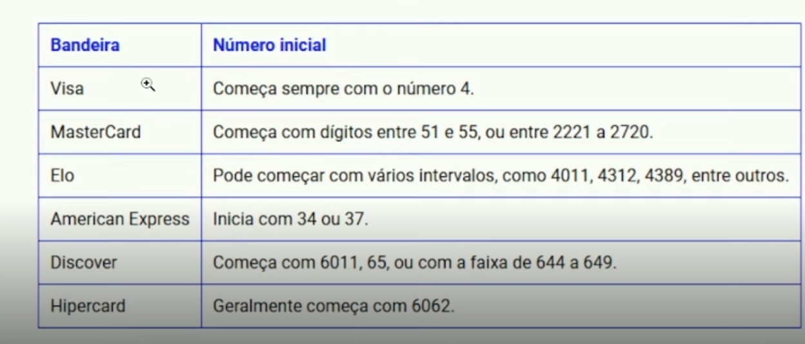

# 💳 Validador de Cartão de Crédito

<div align="center">

 [](https://credit-cardvalidator.netlify.app/)

</div>

## 📋 Descrição do Projeto

Validador de números de cartão de crédito que identifica automaticamente a bandeira e valida o número utilizando o algoritmo de Luhn. Suporta as principais bandeiras do mercado:

- Visa
- Mastercard
- American Express
- Discover
- Elo
- Hipercard
- E outras...

---

## 🎯 Funcionalidades

- ✨ Identificação automática da bandeira do cartão
- ✅ Validação do número usando algoritmo de Luhn
- 🎨 Interface responsiva e moderna
- 💡 Feedback visual com ícones das bandeiras
- 🔄 Validação em tempo real

---

## 🛠️ Tecnologias Utilizadas

- HTML5
- CSS3
- JavaScript Vanilla
- SVG para ícones das bandeiras
- GitHub Copilot para auxílio no desenvolvimento da lógica

---

## 📊 Como Funciona

### Identificação da Bandeira

O sistema identifica a bandeira do cartão baseado nos seguintes padrões:

| Bandeira | Padrão |
|----------|--------|
| Visa | Começa com 4 |
| MasterCard | Começa com 51-55 ou 2221-2720 |
| Elo | Começa com 4011, 4312, 4389, etc |
| American Express | Começa com 34 ou 37 |
| Discover | Começa com 6011, 65 ou 644-649 |
| Hipercard | Geralmente começa com 6062 |

### Validação do Número

A validação é feita utilizando o algoritmo de Luhn, que:
1. Dobra os dígitos alternados da direita para a esquerda
2. Soma todos os dígitos
3. Verifica se o total é divisível por 10

---

## 🚀 Como Usar

1. Acesse a página do validador
2. Digite o número do cartão no campo de entrada
3. O sistema automaticamente:
   - Identificará a bandeira (mostrando o ícone correspondente)
   - Validará o número
   - Fornecerá feedback visual

---

## 💻 Código

O projeto está estruturado em três arquivos principais:

- `index.html`: Estrutura da página
- `styles.css`: Estilização e design responsivo
- `index.js`: Lógica de validação e interação

---

## 🤖 Desenvolvimento

A lógica da validação foi desenvolvida com o auxílio do GitHub Copilot, através da anexação da imagem abaixo:

e do seguinte prompt:
```
Create a function to validate a number credit card with base image 'base.png' to discover the field 'bandeira'. 
```
```
Use regEx from the most used credit cards, like visa, mastercard, diners club, jcb, hipercard, elo, american express and aura
```

Desenvolvido por [@wilsondesouza](https://github.com/wilsondesouza)